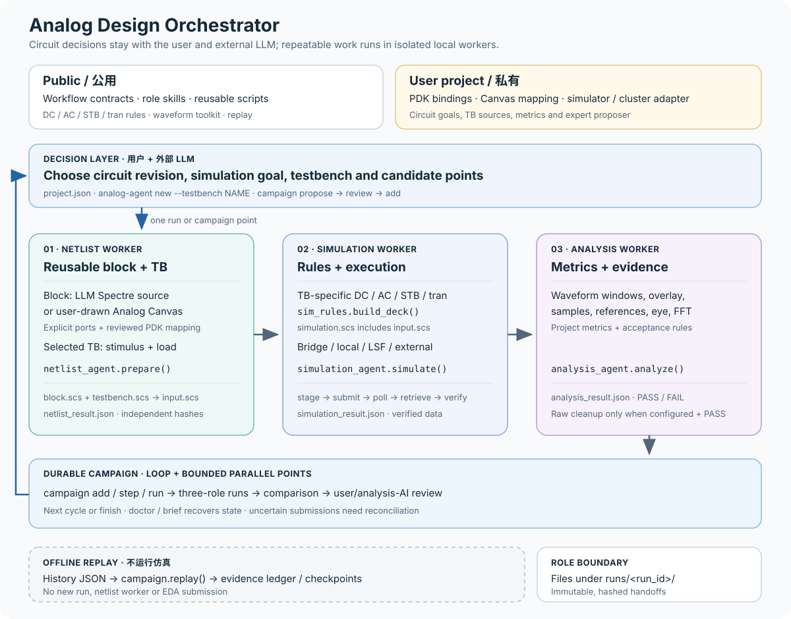

# Analog Design Orchestrator（ADO）

**面向模拟集成电路设计、仿真与分析的可追溯工作流。**

[English](README.md)

ADO 把电路决策与 EDA 环境操作分开：用户或外部 LLM 控制器提出电路版本，三个独立进程分别准备网表、执行配置好的仿真、测量结果。每一步都在独立的 run 目录留下持久化交接文件与哈希。

为兼容现有工程，Python 包和命令仍叫 `analog-agent`；**ADO 是项目正式名称，不是新的 CLI 命令。**



图中区分了三个角色的交接、campaign 的决策循环，以及不调用仿真器的离线回访。公用脚本与用户私有适配器服务同一工作流，框架本身不写死 PDK 或站点环境。

## 已实现的能力与边界

- 可选的复用电路 `block.scs` 与按测量目标选择的 `testbench.scs` 独立保存，合成兼容现有后端的 `input.scs`；仿真角色单独管理 `simulation.scs` 和 DC、AC、STB、瞬态规则。原有单文件模式仍可用。
- Bridge、本地 Spectre，以及异步 LSF 的**后端接口**。LSF 必须由用户实现私有站点适配器；仓库提供的是接口模板，不是已经连通的集群配置。
- 持久化状态 `CREATED → NETLIST_READY → STAGED → SUBMITTED → RUN → DONE → RETRIEVED → VERIFIED → ANALYZED`。短作业可能跳过 `RUN`，明确失败进入 `FAILED`。`resume` 每次轮询一次；作业完成后继续取回与校验。
- 通用波形分窗、重叠、取点、参考线对照、眼图及 FFT；电路专属指标由项目插件提供。
- 公用配置与用户私有的配置、脚本、skill 分层。

当前三个 worker 是确定性的 Python 子进程，**不是内置的三个自主 LLM**。外部 LLM 可以根据交接结果决定下一版电路；可选的私有记忆层现已支持限长检索和显式审核后写回，但不会自行批准经验，也没有“适用于所有集群的现成适配器”。

## 安装与首次试运行

使用 Python 3.10+，并选择能够运行目标仿真器的环境。Cadence Bridge 模式需要环境中已有 `virtuoso_bridge`；ADO 不提供 Spectre、Virtuoso、PDK 或许可证。在本仓库目录安装：

```sh
python -m pip install -e .
# 绘图功能可选：python -m pip install -e '.[analysis]'
```

`project.example.json` 是 RC 冒烟测试，里面的路径相对于**本仓库**。只验证网表生成、不启动仿真器时：

```sh
cp project.example.json project.json
analog-agent new project.json
```

命令会返回 `runs/<run_id>` 路径。尚未配置仿真器或私有站点适配器前，不要执行 `submit`。独立的用户工程应把自己的 `project.json`、设计模板或生成器、分析规则和 `private/` 放在同一项目根目录；从示例复制配置后，必须修改所有相对路径。

## 用户究竟需要配置什么

| 范围 | 用户填写的内容 | 位置 |
|---|---|---|
| 电路项目 | 设计模板**或** `netlist.generator`、合法参数与候选值、分析类型、保存信号、指标插件和由用户定义的判定规则 | `<project>/project.json`、模板及规则/插件文件 |
| 私有全局环境 | 仿真器路径或 Bridge profile；若用 LSF，还需主机与传输拓扑、队列及资源、远端目录、PDK 模型路径和 section | `<project>/private/global/config/` 与私有复用脚本 |
| 网表角色 | 工艺合法器件、引脚顺序、模型 include 和电路专属生成器 | `<project>/private/agents/netlist/` |
| 仿真角色 | DC/AC/STB/tran/自定义规则、执行后端与站点适配器、轮询/回传/清理策略 | `<project>/private/agents/simulation/` 及 `simulation` 配置 |
| 分析角色 | 电路专属测量函数与阈值、可选波形操作请求 | `<project>/private/agents/analysis/` 及 `metrics`/`rules` 配置 |

### 可复用 block 与按仿真需求选择的 TB

新工程可用 `netlist.block` 指向 LLM 编写的 Spectre `subckt`（`kind: source`），或用户在本地 Analog Canvas 绘制的 `.icproj.json`（`kind: canvas`）。必须声明 `name` 和有序 `pins`，不能从画布外观猜测端口。`netlist.testbenches` 列出各个独立 TB，`default_testbench` 指定默认项。例如：

```json
{
  "netlist": {
    "block": {"kind": "source", "path": "blocks/dut.scs", "name": "dut", "pins": ["IN", "OUT", "VSS"]},
    "testbenches": {"dc": {"path": "tb/dc.scs"}, "ac": {"path": "tb/ac.scs"}},
    "default_testbench": "dc"
  }
}
```

TB 负责实例化 block、激励和负载；DC/AC/STB/tran 分析语句仍由仿真角色依据 `simulation.rules` 写入。可选的 `simulation.rules_by_testbench` 将 TB 名称映射到不同规则文件列表，例如 `{"dc": ["rules/dc.json"], "ac": ["rules/ac.json"]}`。执行 `analog-agent new project.json --testbench ac` 可选择 AC TB 及对应规则组。campaign 的每个 point 也可写 `"testbench": "ac"`；参数相同但 TB 不同的点视为不同任务。网表角色独立保存 `block.scs`、`testbench.scs` 及哈希，再合成给现有仿真后端的 `input.scs`。修改已交接内容须新建 run。

Canvas block 使用 `project` 代替 `path`。推荐在 block 中设置 `"canvas_root_config": "private/global/config/canvas.json"`，该私有 JSON 写入 `{"canvas_root": "本机已构建的 Analog Canvas 路径", "node": "node"}`；ADO 只实现导出接口，不内置安装位置。也可使用旧的 `canvas_root`，或私有工艺映射函数，例如 `"adapter": "private/agents/netlist/scripts/map_canvas.py:export"`，三者只能选一种。函数接收 `(config, task, run, values)`，返回生成的 Spectre block 文件路径。额外映射或模型输入列入 `netlist.block.dependencies`；运行时会记录私有 Canvas 配置及导出模块哈希。Canvas 导出与端口检查仅验证结构，工艺映射和电气结果仍需用户审查；公用框架不含某种 PDK 或电路目标。

该能力在 `new` 或 campaign point 的 `CREATED`→`NETLIST_READY` 网表阶段触发。既有的离线多轮回访位于 campaign 的决策验证阶段，命令为 `analog-agent campaign replay PROJECT.json HISTORY.json`；它只读取记录的提案、比较和决策，不生成 block/TB、不创建 run，也不启动仿真。因此回访用于检验决策闭环，不代替电气验证。

可参照 `private.example/` 的文件形状。四个可选的 `private/**/config/overrides.json` 会在运行时覆盖公用配置；其内容不复制到 run 的 `config.json`，run 只记录这些文件的 SHA-256，配置中途改变会拒绝续跑。示例中的 `pdk.json`、`transfer.json` 等其他私有文件**不会被核心自动读取**，需要用户的网表生成器或站点适配器主动读取。密码只应通过交互提示或操作系统密钥设施取得，不能写入配置、命令参数、运行产物或仓库。若用户工程单独使用 Git，也应忽略其 `private/` 与 `runs/`。

远端站点建议依次配置并验证：（1）登录链路及实际远端身份、项目目录；（2）PDK/模型可见性及网表器件、include 映射；（3）带哈希校验的上传和下载；（4）LSF 队列、资源、job ID 与状态轮询；（5）Spectre 命令、模式、输出目录和成功判据；（6）结果回传、指标解析和验证后的清理。对于 SSH→Telnet→LSF 站点，这些步骤由私有适配器及复用脚本实现。每个关键步骤应保存实际输出，不能只凭命令退出就推断登录或仿真成功。

### 选择仿真后端

| 后端 | 用户需提前完成 | 运行方式 |
|---|---|---|
| `bridge` | 可用的 Virtuoso Bridge 环境/profile 与 Spectre 访问 | 同步提交并解析校验结果 |
| `local` | 本地 Spectre 可执行文件（`simulation.spectre_cmd`） | 同步提交并解析校验结果 |
| `lsf` | 在 `simulation.adapter` 指定私有工厂函数，实现六个站点方法 | 异步提交；每次 `resume` 轮询一次 |

LSF 用户可以在私有 `overrides.json` 中选择后端，不公开站点细节：

```json
{
  "simulation": {
    "backend": "lsf",
    "adapter": "private/agents/simulation/scripts/site_lsf_adapter.py:create",
    "remote_cleanup": "manual"
  }
}
```

复制[适配器模板](private.example/agents/simulation/scripts/site_lsf_adapter.py)，用本站可复用函数实现 `stage`、`submit`、`poll`、`retrieve`、`verify`、`cleanup`。其中 `stage` 要确认仿真 deck 哈希，`submit` 返回真实 job ID，`poll` 区分已提交/RUN/DONE/失败，`retrieve` 给出本地文件及 SHA-256（提供 `remote_sha256` 才能进行两端对照），`verify` 同时核实调度器和仿真器成功并返回解析后的数据。建议以 run ID 作为远端幂等键，避免“已提交但本地交接尚未落盘”时的重试产生重复作业。通用核心会核对状态及本地文件，并在提供远端哈希时进行对照；但不能替未实现的适配器证明登录或传输成功。

无论选哪种后端，用户还需选择 `simulation.rules`（可参考公用 [DC](agents/simulation/config/dc.json)、[AC](agents/simulation/config/ac.json)、[STB](agents/simulation/config/stb.json)、[tran](agents/simulation/config/tran.json)）、`save_signals`、仿真模式、超时以及 PSF ASCII 输出。STB 的探针必须改为电路网表中的真实实例；公用示例只是占位，稳定性裕量的解释仍由项目分析插件负责。安装环境支持的其他分析可使用 Python 规则渲染器。PDK include 应由项目设计网表/生成器或配置的 include 文件提供，不写进通用引擎。

## 运行与断线续跑

```sh
analog-agent new project.json --iteration 0 --set R=2k
analog-agent submit RUN_DIR
analog-agent status RUN_DIR
analog-agent resume RUN_DIR       # 异步 LSF 可重复调用
analog-agent analyze RUN_DIR      # 仅在本地结果验证完成后
```

Bridge/本地模式的 `submit` 一次完成；LSF 模式返回 run，待作业状态变化后再次调用 `resume`。`analog-agent run project.json` 遇到异步提交也会返回，不会无限等待。每个 run 保留任务状态历史、输入哈希、阶段交接、日志或回传产物及分析报告。**同一个 run 应始终在相同的路径环境中继续**；例如创建时记录的是 WSL `/mnt/e/...`，不能中途改用 Windows `E:\...` 路径续跑。

`workflow.submission` 为 `manual` 或 `auto`；`return_mode` 为精简 `summary` 或完整解析数据；`cleanup` 为 `never` 或通过分析后清理本地 raw 的 `after_success`。`simulation.remote_cleanup` 可选 `never`、`manual`、`after_verified`；`cleanup-remote RUN_DIR` 只在本地验证后调用私有后端。队列接受任务或工具命令退出，都不能单独证明仿真成功。

### 可续跑的并行设计会话

用户或分析 AI 决定扫参点时，可在 `project.json` 增加可选的 `campaign` 配置。以下仅是**执行额度**，不是电路初值或性能标准：

```json
{
  "campaign": {
    "max_parallel": 2,
    "max_points_per_cycle": 16,
    "max_cycles": 10,
    "max_total_points": 100,
    "poll_interval_s": 10,
    "metric_directions": {"gain_1g_db": "max"}
  }
}
```

创建会话，审核候选点文件（例如 [RC 示例](examples/campaign_points.json)），再执行一轮：

```sh
analog-agent campaign new project.json
analog-agent campaign add CAMPAIGN_DIR examples/campaign_points.json
analog-agent campaign run CAMPAIGN_DIR --max-seconds 3600
analog-agent campaign status CAMPAIGN_DIR
```

`campaign run` 同时最多运行 `max_parallel` 个点，轮询由本地脚本负责，不必让 LLM 逐个盯作业。每个任务完成后即取回、校验、分析；全部任务分析或失败后才生成本轮对比报告，包含参数、指标、判定、失败信息和可选的 Pareto 集。核心**不内置**评分公式、gₘ/Iᴅ 初值、优化算法或统一 spec。`metric_directions` 仅控制可选的 Pareto 方向；下一轮点位和最终选择由用户及分析 AI 决定。

审核后，可用 `campaign add CAMPAIGN_DIR NEXT_POINTS.json --decision "理由" --select POINT_ID` 开启下一轮，或用 `campaign finish CAMPAIGN_DIR --decision "理由" --select POINT_ID` 收尾。用户可在私有配置中指定 `campaign.proposer`（如 `private/agents/analysis/scripts/site_proposer.py:propose`），通过 `campaign propose CAMPAIGN_DIR` 生成候选建议；审核保存的 JSON 后再明确调用 `add`。仓库的[私有提案模板](private.example/agents/analysis/scripts/site_proposer.py)不包含 PDK 方法或自动优化器。

`campaign replay PROJECT.json HISTORY.json` 是公用的离线多轮回放功能；[两轮示例](examples/replay_history.json)可配合 `project.example.json` 运行。历史文件提供每轮已记录的对比结果和决策；核心逐轮校验并在内存中积累不含电路假设的证据。它不要求电路专属知识或 proposer，也不会创建 run 或调用仿真器。若项目配置了私有 proposer，回放可将证据交给它并校验候选。某轮设 `"source": "proposal"` 时，观测参数必须来自该轮提案；人工选择的点可设为 `"manual"`。命令行仅返回检查点 ID 和哈希，不输出私有知识内容。私有经验是否抽为公用脚本或 skill，由主 agent 按[知识公用化流程](agents/analysis/skills/knowledge-promotion/SKILL.md)审核和实现，用户项目不需要提供发布函数。

### 限长检索的私有记忆

记忆为可选功能，保存在用户工程，不存入公用仓库。将[空白私有示例](private.example/agents/analysis/memory.json)复制到 `private/agents/analysis/memory.json`，并参考[私有 override 示例](private.example/agents/analysis/config/overrides.json)配置 `memory.path`、`memory.context`、`hard_keys`、`max_items` 和 `max_chars`。检索上下文与电路目标由用户定义。默认硬过滤键是 `pdk`、`model_revision`、`topology`：条目声明了这些范围、但与查询不符或查询缺少该键时，条目不会进入结果。其余已审核条目按上下文/标签匹配数排序，同分时按稳定 ID 排序。默认最多返回四条短摘要、序列化后最多 1200 字符；不向 LLM 发送原始波形、完整证据，也不需要向量库。字符上限是确定性上下文约束，不等于精确 tokenizer 计数。

```sh
analog-agent memory brief project.json              # 首次电路决策前检索
analog-agent memory show project.json ENTRY_ID      # 需要时才读取完整证据
analog-agent memory submit project.json private/agents/analysis/CANDIDATE.json
analog-agent memory review project.json ENTRY_ID --approve --reason "已核对证据"
# 或：--reject --reason "有反例或适用范围失效"
```

候选 JSON 放在 `private/` 下，包含 `id`、`kind`、不超过 300 字的摘要、`scope` 对象和至少一个相对工程目录的 `evidence` 文件路径，例如 `{"id":"lesson_a","kind":"design","summary":"仅在声明范围内成立的测量经验","scope":{"pdk":"process_a","topology":"stage_a"},"evidence":["campaigns/ID/cycle-0001_comparison.json"]}`。提交时记录证据哈希；证据改变则不能通过审核。候选或被否决条目不会被检索。`campaign new` 和每一轮会保存精简记忆快照；`campaign propose` 把快照交给私有 proposer，`campaign brief` 在中断后还原本轮冻结的选择。活动轮次中途修改记忆文件会触发输入不一致保护，须先处理该轮状态。`campaign replay` 仍只是内存中的决策回放，不会批准或发布记忆。

若聊天因 token 不足而中断，先运行 `campaign doctor CAMPAIGN_DIR` 检查持久化状态，再用 `campaign brief CAMPAIGN_DIR` 获取供 AI 接续的精简摘要；随后 `campaign run` 或 `campaign step` 可脱离旧聊天记录续跑。`doctor` 可跨 Windows/WSL 解析项目内保存的 run 与工件路径，而不改写证据；进行中的一轮仍须在原路径环境执行，进入 `REVIEW` 决策边界后，下一轮可在另一环境启动。`campaign pause`/`resume` 暂停或恢复本地调度，不会停止已提交的远端作业。若提交可能已发生但本地没有回执，状态会被标为不确定，**绝不盲目重投**。LSF 私有适配器可选实现 `reconcile(run, config, staged, intent)`，按 run ID 查找真实作业；`analog-agent reconcile RUN_DIR` 接管查证过的回执后，才可用 `campaign retry CAMPAIGN_DIR POINT_ID` 重新启用该步骤。没有查询能力时，须人工核对调度器，不可直接重试。同一轮会冻结公用配置、私有 override 和已声明的模板、规则、插件、include 文件哈希；其他站点依赖可列入 `campaign.dependencies`。应在两轮之间修改电路配置。会话数据放在被忽略的 `<project>/campaigns/`，独立用户工程也应忽略该目录。过时且已暂停或尚为空的 campaign 可用 `campaign retire CAMPAIGN_DIR --reason "..." [--superseded-by CLOSED_CAMPAIGN_DIR]` 退役；命令保留清单备份，不触碰 run 或远端作业，也不声称仿真通过。

若站点必须通过交互式或其他进程外方式执行仿真，可设 `simulation.backend` 为 `external`。相同的 `campaign step/run/doctor` 工作流只生成并暂存带哈希的 deck，返回 `AWAITING_EXECUTION`，不会自行提交。私有站点仿真角色完成传输、提交、取回和验证，写入标准 run 交接文件并达到 `VERIFIED`；下一次 `campaign step` 继续调用分析角色和设计循环。通用核心不包含 SSH、Telnet、LSF 或凭据处理；站点角色必须遵守 run 状态与哈希契约。`external` 是可恢复的协调边界，不代表无人值守仿真。

若某次仿真已核验、随后必须修正分析输入，可保留原 campaign 作为审计记录，并用修正后的输入新建 campaign。`campaign attach CAMPAIGN_DIR POINT_ID VERIFIED_RUN --reason "..."` 会检查工程、精确参数点、网表/deck 哈希和仿真回执，再复用该 run；不会重投作业。

## 结果、波形与角色边界

网表 worker 负责 `netlist_result.json`；仿真 worker 负责 `simulation_plan.json`、暂存/提交/轮询/回传文件，验证后才写 `simulation_result.json`；分析 worker 负责 `analysis_result.json`。设计网表交接后不可再改动。项目专属指标插件接收解析后的数据并返回数值。`PASS` **仅表示用户配置的 `rules` 通过**，不是某种电路的通用性能保证。

使用 [waveform_tool.py](agents/analysis/scripts/waveform_tool.py) 和 `agents/analysis/config/` 下的 JSON 请求，可进行分窗、重叠、插值取点、参考线、眼图折叠与 FFT。绘图功能需可选的 NumPy、Matplotlib。大量波形保存在文件中；给 LLM 的默认上下文应只包含关键指标、判定、相关图路径和按需截取的数据。

`AGENTS.md` 为各角色指引项目内 skills。公用 skill 与脚本应保持稳定；工艺和电路专属知识放在用户工程中。私有记忆层以经审核的证据辅助决策，不改变确定性的执行契约，也不自动将用户知识升级为公用代码。

## 远期规划（尚非当前版本能力）

- **PVT 与蒙特卡洛：** 增加 corner、温度、电源、电路随机变化以及样本数/种子的声明式配置，支持有界调度、逐点溯源、部分失败恢复和跨 corner/统计结果分析。`virtuoso-bridge` 已提供驱动 Maestro 的能力，但 ADO **尚未**把 Maestro 的 PVT/MC 配置、执行和结果回收封装为可移植且经过测试的角色工作流。网表驱动与 Maestro 驱动两条路径应共用 run 证据和分析契约，工艺 corner 与模型仍由用户私有配置负责。
- **贝叶斯优化器：** 在现有可替换的 `campaign.proposer` 接口上增加利用证据台账提出候选批次、处理不确定性与约束的私有或可插拔策略。初值、目标函数、spec 和停止决策仍由用户工程定义；候选点必须经用户/分析 AI 审核后才能提交。公用执行框架不绑定某类电路，也不改变三个确定性 worker 的交接。
- **版图子 agent：** 在经过审核的电路 block 之后增加独立的版图阶段、不可变交接产物和用户确认边界。私有工艺规则与工具负责版图生成或导入、DRC/LVS/PEX 检查，并把后仿结果回馈到现有分析与 campaign 循环。这是计划中的第四角色，当前三角色版本尚不具备该能力。

这些项目要经过多轮真实工程测试后才考虑纳入稳定版本；API 或结构上可调用不等于电气结果和完整工作流已验证。

## 验证与发布边界

本地测试命令为 `python -m unittest discover -s tests -q`。测试覆盖同步交接、规则生成、波形工具及**假** LSF 适配器的跨进程续跑；不能代替任何用户的真实集群验收。发布某个站点配置前，应凭该站点实际捕获的输出核对登录身份、PDK 可读性、传输哈希、调度器 job ID/状态、仿真日志、结果回传和清理。

CLI 与交接格式仍在演进（`pyproject.toml` 当前版本为 `0.1.0`）。项目采用 [MIT 许可证](LICENSE)。
